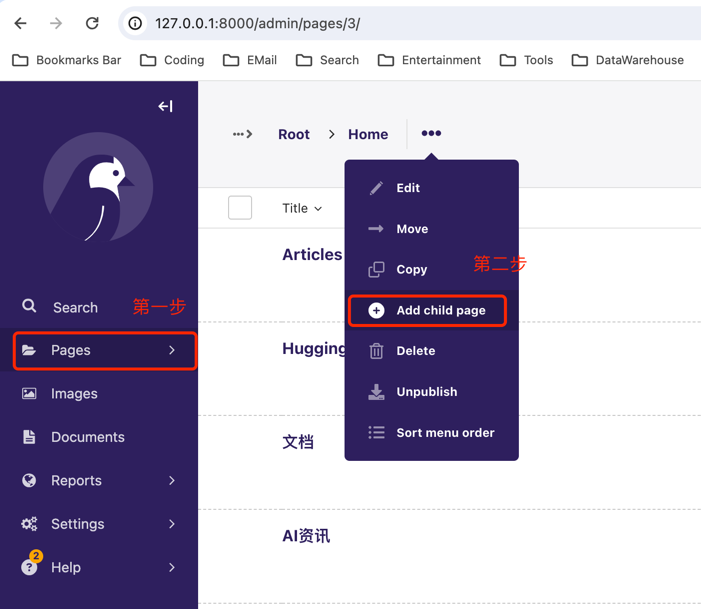
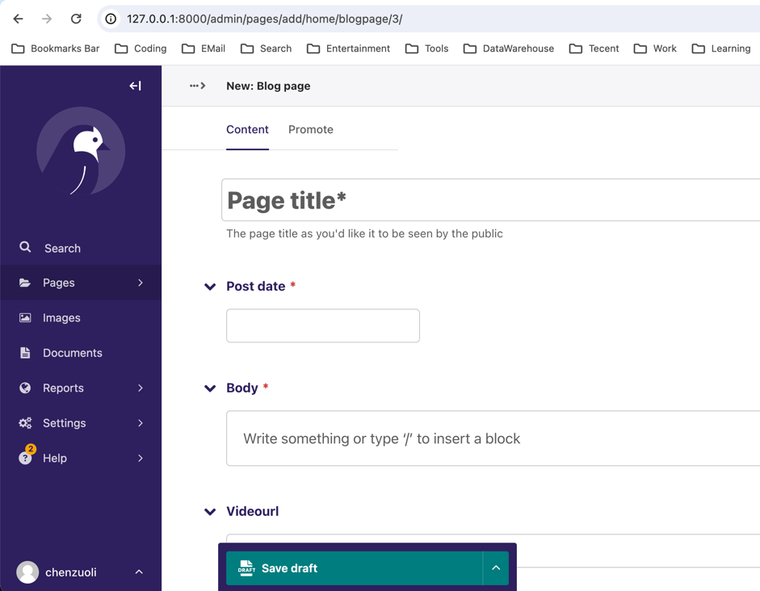
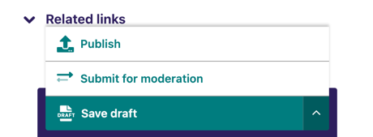

# intro

It's built by wagtail cms.

I build this project for helping people who are worry about being replaced by AI.

You can learn how to use AI tools in this website, and raise productivity.

For beginners, you can learn the situation about AI techology, and choose the `suitable direction` for your career.

Or you can `change your job` to the field that is hardly easy replaced by AI.

Let's do it.


# tools

1. chatbot online
```
npm install botui --save
```

2. language model
```
chatgpt
```

3. text to img
```
stable-diffusion-v1-5
```

4. img to img 
```
stable-diffusion-v1-5
```


# 启动
```shell
python manage.py runserver
```

# 访问后台管理页面
```http
http://127.0.0.1:8000/admin
```

# 使用方法
1. 新建model
2. 新建page

3. 对page中的内容、字段进行编辑，命名发布的url

4. 发布
